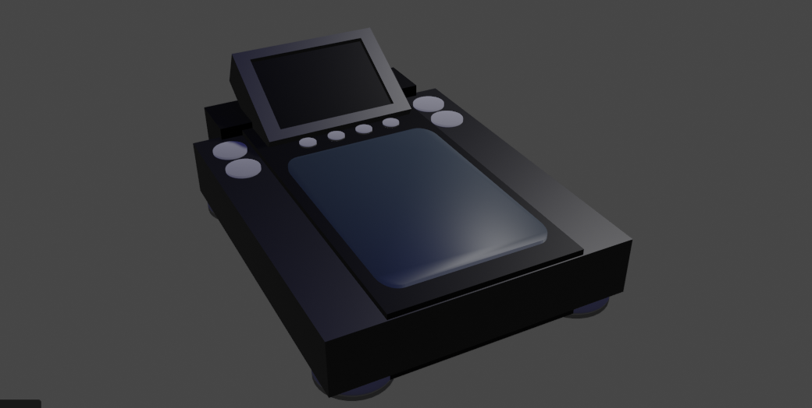

# Neurodeck

## What is a Neuro Deck?
A Neuro Deck is an N-dimensional music-playing device for DJ's. \
Consider the following: \
 * Block Decks and AlphaTheta / Pioneer DJM's are 0D (MIDI Synth Arranger)
 * Track Decks and AlphaTheta / Pioneer CDJ's are 1D (CD / DVD / Blu-Ray)
 * Remix Decks and AlphaTheta / Pioneer DJS's are 2D (MPC / NI Maschine)
 * Neuro Decks and AlphaTheta / Pioneer NDJ's are 3D / ND (Sensor Mats)

## What can I use it with?
It should be designed to work alongside your existing \
AlphaTheta / Pioneer CDJ Setup as an extra type of Player. \
The existing system may have to be reworked to support NDJ's.

## Features:
 * Large Palm Pressure Sensitivity Area
 * Scale Suitable for All Sizes of Hand
 * Four Main Modes of Default Operation
 * Neural Encoder for Surround Channels
 * Front Side HDMI / USB Extender Ports
 * VR Headset Compatibility of Mini-ITX
 * Multiple Layers of Elaborate Puzzles
 * Impulse Layer with MIDI / MP4 Inputs
 * Transformer Layer with Hidden Detail
 * Perception Layer with Random Samples
 * Web Server Puzzle Solving Interfaces
 * Loads Neural Models via File Browser
 * Different Sample Plays Every Pad Hit
 * Patterned Access to Random Generator
 
## Modular Synthesis
TheMindVirus has made a Work-In-Progress Album \
entitled "Modular" containing 4 Stem Tracks and \
a Bonus 5th Track called "Modular Synthesis". \

The Main Theme is based on the Constraints of \
known Modular Synthesiser technology and is \
designed to be played on a variety of equipment.

### Line By Phono Graph
Based On: 1970's Radio Transmissions
Emulator: A 3xOsc was used.
Low End: Numark PT-01 Scratch
High End: Pioneer PLX-1000 Turntable
Method: Control Vinyl on Direct-Drive
Neural: Light Finger Taps on the Neural Deck

### Send It On Ahead
Based On: 1970's Postal Logistics
Emulator: A 3xOsc was used.
Low End: Yamaha PSR-280 Keyboard
High End: Korg Minilogue XD
Method: Mini-Moon Preset
Neural: Swaying Side Swipes on the Neural Deck

### Return To The Wild
Based On: 2000's Jungle Drums
Emulator: An FPC was used.
Low End: Linn Drum Sampler
High End: Akai MPC Live
Method: Linn-Drum Preset
Neural: Segmented Pressure Pads on the Neural Deck

### Master Of The Arts
Based On: 2000's Overclocking Bass
Emulator: A 3xOsc was used.
Low End: Ibanez GIO Bass Guitar
High End: Behringer ARP 2600 Modular
Method: Lifter Bass with Portamento / Glide
Neural: Palm Pressure Level on the Neural Deck

## Future Integration
 * FL Studio by Image-Line for the Arranger of the initial tracks for testing
 * Traktor by Native Instruments for External Source Deck as an extra deck type
 * Serato Scratch by Serato for Digital Vinyl System interfaces and control vinyl
 * Autopilot by Deadmau5 for the MIDI Arranger Decks and also as an extra deck type
